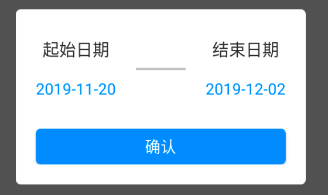

# DialogDateSlot
日期时间段选择对话框，如：(2019-10-11 ~ 2019-11-06)


<p/>


### 引入方式 
[](https://jitpack.io/#Dazhi528/DialogDateSlot)
[](https://android-arsenal.com/api?level=16)


Add it in your root build.gradle at the end of repositories:
```
allprojects {
    repositories {
        ...
        maven { url 'https://jitpack.io' }
    }
}
```

Add the dependency
```
dependencies {
    implementation 'com.github.Dazhi528:DialogDateSlot:x.x.x'
}
```

### 实例代码
见sample目录(kotlin)
```
DialogDateSlot(this, "2019-11-20",
                    "2019-12-02", InteDateSlot { dateSta, dateEnd ->
                Toast.makeText(this,
                        "开始：$dateSta ~ 结束：$dateEnd",
                        Toast.LENGTH_LONG)
                        .show()
            }).show()
```